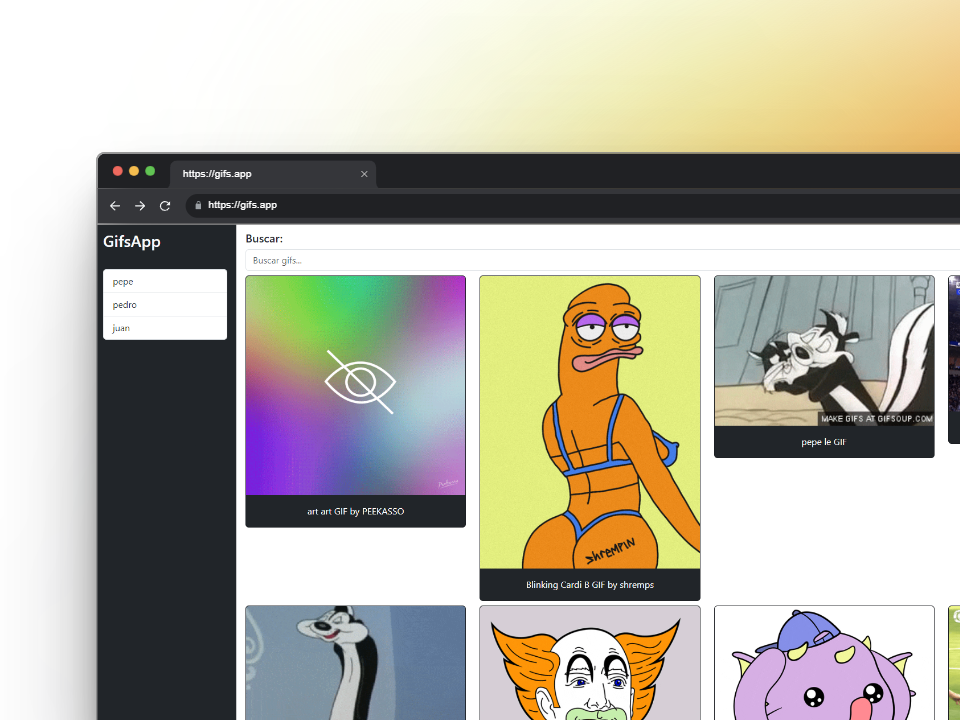

# GIF Apps - SPA en Angular

GIF Apps es una aplicación de una sola página (SPA) construida con Angular que permite buscar y mostrar imágenes de GIFs utilizando la API de Giphy.

## Características

- **Búsqueda de GIFs**: Los usuarios pueden buscar GIFs ingresando palabras clave.
- **Mostrar resultados**: Muestra los resultados de la búsqueda en una cuadrícula de imágenes.
- **Responsivo**: Diseño adaptativo que se ajusta a diferentes tamaños de pantalla.

## Tecnologías utilizadas

- **Angular**: Framework de desarrollo para construir aplicaciones web.
- **Angular CLI**: Herramienta de línea de comandos para gestionar el ciclo de vida de la aplicación Angular.
- **Bootstrap**: Framework CSS para un diseño responsivo y moderno.
- **Giphy API**: API utilizada para obtener los GIFs.

## Requisitos previos

Antes de comenzar, asegúrate de tener instalados los siguientes programas:

- [Node.js](https://nodejs.org/) (versión 18 o superior)
- [Angular CLI](https://angular.io/cli) (versión 17 o superior)

## Instalación

Sigue estos pasos para configurar y ejecutar el proyecto en tu máquina local:

1. **Clonar el repositorio**:
   ```bash
   git clone https://github.com/tu-usuario/gif-Apps.git
   cd gif-Apps
